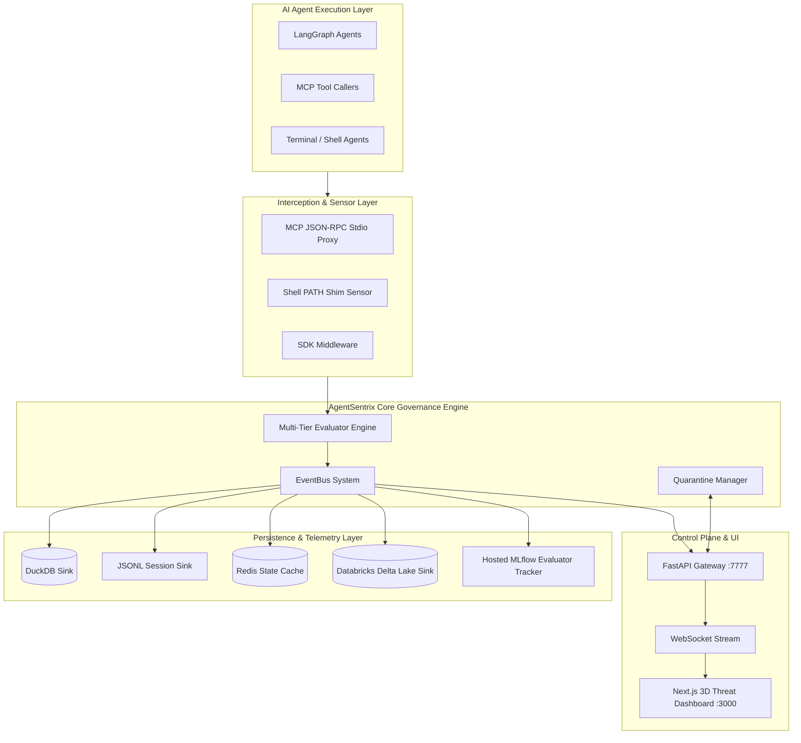
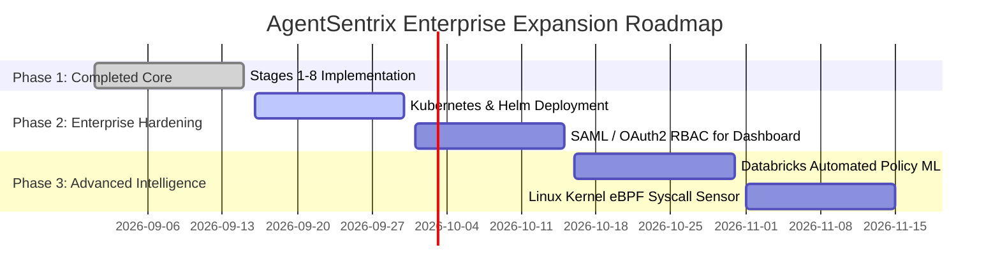

# AgentSentrix: Enterprise Technical & Architecture Report

> **System Status**: Fully Operational (Stages 1–8 Completed & Verified)  
> **Test Suite**: 38 / 38 Unit & Integration Tests Passing (100%)  
> **Frontend Status**: Next.js 14 Production Build Compiled Successfully  

---

## 1. Executive Summary

**AgentSentrix** is an enterprise-grade, real-time security proxy and governance platform for autonomous AI agent workflows (LangGraph, AutoGen, CrewAI, MCP agents). 

It intercepts agent tool execution requests—such as file reads/writes, command-line executions, database queries, network egress attempts, and MCP server interactions—evaluates their risk dynamically through a multi-tier assessment engine, and enforces real-time security policies (**ALLOW**, **QUARANTINE**, **BLOCK**).

All telemetry is streamed live to a 3D visual command center dashboard and persisted into local DuckDB, JSONL session logs, Redis state caches, cloud-hosted **Databricks Delta Lake**, and **Databricks-hosted MLflow** for LLM evaluation tracking.

---

## 2. Complete Architecture & Completed Stages (Stages 1–8)



---

### Detailed Breakdown of Implemented Stages

#### Stage 1: Async Event Bus & Persistence Infrastructure
* **EventBus**: High-throughput asynchronous publish-subscribe bus with monotonic sequence (`seq`) ordering and ULID event identification.
* **DuckDB Sink**: Analytical SQL sink writing to `data/agentsentrix.duckdb` with automatic fallback to memory mode on process lock contention.
* **JSONL Sink**: Append-only audit logger storing per-session event chains in `data/sessions/session_<id>.jsonl`.
* **Redis State Cache**: Microsecond-latency cache (`localhost:6379`) storing agent lineage, active session statistics, and pending quarantine items, with automatic in-memory fallback.

#### Stage 2: Multi-Tier Risk Evaluation Engine
* **Tier-0 (Rule-Based & Regex Pattern Engine)**: Evaluates high-speed static policies, entropy checks (detecting leaked AWS keys, JWTs, private keys), and path traversal normalization (`/repo/../.env` $\rightarrow$ `/repo/.env`).
* **Tier-1 (Local SLM)**: Invokes Ollama (`qwen2.5-coder` or `llama3.2`) for fast local semantic analysis.
* **Tier-2 (Cloud LLM)**: Asynchronously queries Groq / OpenRouter (`llama-3.3-70b-versatile` / `deepseek-coder`) for deep intent analysis.
* **Blast Radius Calculator**: Calculates dynamic blast radius score (0–100) based on files touched, reversibility, secret exposure, and network egress attempt.

#### Stage 3: MCP Interception Proxy & Quarantine Suspension
* **MCP Stdio Proxy**: Intercepts stdio-based Model Context Protocol (MCP) JSON-RPC 2.0 tool calls (`tools/call`).
* **Quarantine Manager**: Suspends risky tool calls asynchronously using `asyncio.Future`, placing requests on hold while emitting a WebSocket alert for human review.

#### Stage 4: Shell PATH Shim Sensor
* **Transparent Binary Shims**: Traps interactive terminal commands (`git`, `curl`, `python`, `pip`, `docker`) via PATH pre-pending.
* **Terminal Quarantine Handler**: Prompts terminal users or holds interactive shell sessions when high-risk commands are detected.

#### Stage 5: FastAPI Control Plane & Real-Time WebSockets
* **REST API Gateway** (`http://localhost:7777`): Provides `/events`, `/graph`, `/decide`, and `/health` endpoints.
* **WebSocket Streaming Server**: Broadcasts real-time JSON event telemetry and handles reconnection catchup history.

#### Stage 6: 4-Agent LangGraph Multi-Agent Simulation
* **LangGraph StateGraph Workflows**: Simulates 4 agent personas (`Refactorer Agent`, `Test Runner Agent`, `MCP Installer Agent`, `Rogue Agent`).
* **Call Stack Lineage (`parent_id`)**: Chains multi-step agent actions into a causality tree for root-cause forensic drilldown.
* **Configurable Throttling**: Adjustable animation step delay (`--delay-ms`) for live demo visualization.

#### Stage 7: Next.js 3D Threat Canvas Command Center Dashboard
* **3D Topology Physics**: Built with Three.js and `react-force-graph-3d` featuring optimized D3 charge repulsion (`-220`), link distance (`90`), and smooth camera focusing.
* **Spacious UI Layout**: Modern dark mode with compact Composite Risk Index gauge (`h-32`), scrollable execution log console, and real-time event feeds.

#### Stage 8: Live Databricks Delta Lake Sink & Hosted MLflow Tracker
* **Cloud Databricks Delta Lake Sink**: Non-blocking `DatabricksSink` buffering events in an `asyncio.Queue` and executing batch parameterized inserts to `workspace.agentsentrix.events` using `databricks-sql-connector`.
* **Databricks-Hosted MLflow Tracker**: `DatabricksMLflowTracker` logging session parameters (`session_id`, `total_events`, `agent_count`) and aggregate evaluation metrics (`pct_blocked`, `pct_quarantined`, `pct_allowed`, `avg_eval_latency_ms`, `human_override_rate`).

---

## 3. How to Run & Operate AgentSentrix

### 1. Start the FastAPI Gateway & WebSocket Server
```powershell
venv\Scripts\python.exe -m uvicorn core.agentsentrix.server.app:app --host 127.0.0.1 --port 7777 --reload
```

### 2. Launch the 3D Command Center Dashboard
```powershell
cd dashboard
npm run dev
# Open http://localhost:3000 in your browser
```

### 3. Run the Multi-Agent Simulation (With Databricks & MLflow Telemetry)
```powershell
venv\Scripts\python.exe -m sim.runner --delay-ms 300
```

### 4. Execute the Full Verification Test Suite
```powershell
venv\Scripts\pytest.exe tests/
```

---

## 4. Current Condition & System Verification

| Component | Status | Details |
| :--- | :---: | :--- |
| **Backend Core** | `OPERATIONAL` | FastAPI server running on `:7777`, DuckDB sink active |
| **3D Dashboard** | `OPERATIONAL` | Next.js 14 running on `:3000`, 3D canvas physics responsive |
| **Databricks Integration** | `VERIFIED` | 8/8 events inserted per run into `workspace.agentsentrix.events` |
| **MLflow Tracking** | `VERIFIED` | Configured with `DATABRICKS_HOST` + `DATABRICKS_TOKEN` env keys |
| **Automated Test Suite** | `38 / 38 PASSED` | 100% test pass rate across Stages 1 through 8 |

---

## 5. Gap Analysis: What is Left for Future Production Expansion

While Stages 1 through 8 form a complete, production-ready demonstration platform, the following features represent the roadmap for full enterprise rollout:



### Remaining Future Roadmap Items:
1. **Container Orchestration & Production Deployment**:
   * Packaged Docker Compose and Kubernetes Helm Charts (`deploy/helm/agentsentrix`) for cloud deployment in AWS EKS / Azure AKS / GCP GKE.
2. **Enterprise Authentication & RBAC**:
   * Add SAML 2.0 / OAuth2 (Okta, Azure AD) role-based access control to the Next.js dashboard so security teams have read/write/decide permissions.
3. **Automated ML Policy Refinement (Databricks Job Pipeline)**:
   * Build a scheduled Databricks Notebook job that mines historical telemetry in `workspace.agentsentrix.events` to automatically generate candidate Tier-0 YARA/YAML rules.
4. **Linux Kernel eBPF Syscall Sensor**:
   * Extend beyond PATH shims to an eBPF kernel program trapping low-level `execve` and `socket_connect` syscalls for non-shell binary agents.
