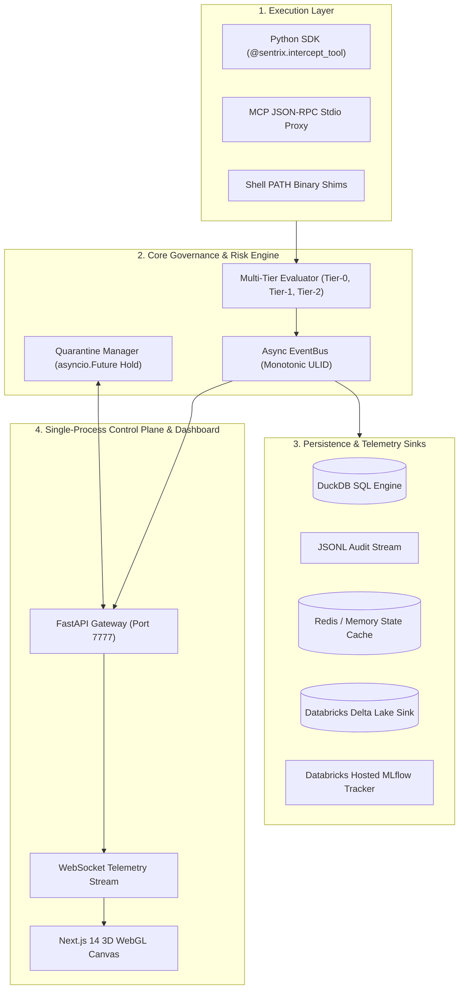

# AgentSentrix — System Implementation & User Operational Guide

> **Document Purpose**: Definitive technical reference mapping every feature, module location, architectural implementation details, and step-by-step usage instructions for the AgentSentrix Platform.

---

## 1. Executive Architecture Overview

**AgentSentrix** is a real-time inline security proxy, risk evaluation engine, and threat visualization platform designed for autonomous AI agent workflows (LangGraph, CrewAI, AutoGen, MCP agents, and custom Python scripts).



---

## 2. Module & Functionality Mapping

Below is the complete reference mapping every platform feature to its exact code file implementation:

| Subsystem / Feature | Primary File Location | Description & Implementation Details |
| :--- | :--- | :--- |
| **Unified CLI (`agentsentrix up`)** | [`core/agentsentrix/cli.py`](file:///d:/AgentSentrix/core/agentsentrix/cli.py) | Single-process CLI application powered by Typer. Launches FastAPI gateway, mounts Next.js static production build, and automatically opens web browser to `http://127.0.0.1:7777`. Includes `up`, `status`, and `version` subcommands with graceful `Ctrl+C` signal handling. |
| **FastAPI Gateway Server** | [`core/agentsentrix/server/app.py`](file:///d:/AgentSentrix/core/agentsentrix/server/app.py) | Application lifespan context manager starting EventBus, DuckDB, JSONL, Redis, and WebSocket manager. Serves REST API routes (`/events`, `/graph`, `/decide`, `/health`). |
| **Single-Process SPA Mounting** | [`core/agentsentrix/server/static.py`](file:///d:/AgentSentrix/core/agentsentrix/server/static.py) | Serves compiled Next.js production export (`core/agentsentrix/web`) directly from FastAPI. Intercepts non-API routes for SPA HTML fallback. |
| **Async EventBus** | [`core/agentsentrix/bus/bus.py`](file:///d:/AgentSentrix/core/agentsentrix/bus/bus.py) | Monotonic sequence (`seq`) subscriber queue broadcasting event telemetry across all persistence sinks and active WebSockets. |
| **Multi-Tier Risk Evaluator** | [`core/agentsentrix/engine/evaluator.py`](file:///d:/AgentSentrix/core/agentsentrix/engine/evaluator.py) | Progressive 3-tier risk engine:<br>• **Tier 0 (~1ms)**: Deterministic YAML policies & Shannon entropy secret detection.<br>• **Tier 1 (~50ms)**: Local Ollama prompt injection & intent drift classifier.<br>• **Tier 2 (~300ms)**: Groq LLM-as-a-judge for ambiguous score bands (30–70). |
| **Blast Radius Calculator** | [`core/agentsentrix/engine/blast_radius.py`](file:///d:/AgentSentrix/core/agentsentrix/engine/blast_radius.py) | Computes dynamic impact score (0–100) based on files touched, action reversibility, secret exposure, and network egress attempts. |
| **Quarantine Manager** | [`core/agentsentrix/proxy/quarantine.py`](file:///d:/AgentSentrix/core/agentsentrix/proxy/quarantine.py) | Suspends high-risk agent operations asynchronously using `asyncio.Future` until operator decision is submitted via `POST /decide`. |
| **Python SDK Decorator** | [`core/agentsentrix/sdk.py`](file:///d:/AgentSentrix/core/agentsentrix/sdk.py) | `SentrixSDK` providing `@sentrix.intercept_tool(agent_id="my-agent")` decorator with async/sync execution support and fail-safe network fallback. |
| **MCP Interception Proxy** | [`core/agentsentrix/proxy/mcp_proxy.py`](file:///d:/AgentSentrix/core/agentsentrix/proxy/mcp_proxy.py) | Intercepts stdio JSON-RPC 2.0 Model Context Protocol tool calls (`tools/call`), evaluates risk before forwarding request to downstream MCP server. |
| **Shell PATH Binary Shim** | [`core/agentsentrix/shims/`](file:///d:/AgentSentrix/core/agentsentrix/shims/) | Intercepts raw terminal commands (`git`, `curl`, `python`, `pip`, `docker`) via PATH pre-pending before shell execution. |
| **DuckDB Analytical Sink** | [`core/agentsentrix/bus/sinks/duckdb_sink.py`](file:///d:/AgentSentrix/core/agentsentrix/bus/sinks/duckdb_sink.py) | SQL analytical engine writing event streams to `data/agentsentrix.duckdb` with automatic memory fallback on file lock contention. |
| **Databricks Delta Lake Sink** | [`core/agentsentrix/bus/sinks/databricks_sink.py`](file:///d:/AgentSentrix/core/agentsentrix/bus/sinks/databricks_sink.py) | Asynchronous non-blocking queue worker executing batch inserts to `workspace.agentsentrix.events` using `databricks-sql-connector`. |
| **Hosted MLflow Tracker** | [`analytics/mlflow_tracker.py`](file:///d:/AgentSentrix/analytics/mlflow_tracker.py) | Buffers evaluation runs and logs aggregate metrics (`pct_blocked`, `pct_quarantined`, `pct_allowed`, `avg_eval_latency_ms`, `human_override_rate`) to cloud MLflow. |
| **3D WebGL Threat Dashboard** | [`dashboard/components/ThreatCanvas.tsx`](file:///d:/AgentSentrix/dashboard/components/ThreatCanvas.tsx) | Built with Three.js and `react-force-graph-3d`. Visualizes agents, target nodes, glowing particle beams, and risk rings (`charge: -220`, `link: 90`). |
| **Composite Risk Index Gauge** | [`dashboard/components/RiskGauge.tsx`](file:///d:/AgentSentrix/dashboard/components/RiskGauge.tsx) | Compact SVG semi-circular arc gauge (`h-32`) rendering overall system threat level (Low, Medium, High, Critical). |
| **Multi-Agent Simulation** | [`sim/runner.py`](file:///d:/AgentSentrix/sim/runner.py) | Simulation runner orchestrating 4 agent personas (`Refactorer`, `Test Runner`, `MCP Installer`, `Rogue Agent`) with call-stack lineage (`parent_id`). |

---

## 3. Step-by-Step Usage Guide

### A. Starting the Unified Platform (`agentsentrix up`)
To launch the complete AgentSentrix platform in a single terminal without any Node.js runtime requirement:

```powershell
agentsentrix up
```
* **Output**: Starts FastAPI Gateway on `http://127.0.0.1:7777`, mounts static Next.js production 3D dashboard, and opens your web browser automatically.
* **Health Verification**:
  ```powershell
  agentsentrix status
  ```

---

### B. Integrating with Python Agents (Developer SDK)
Add 1 line of code to protect any Python tool function:

```python
from core.agentsentrix.sdk import sentrix

# Initialize SDK pointing to local gateway
sentrix.init(api_url="http://localhost:7777", fail_safe=True)

@sentrix.intercept_tool(agent_id="refactorer-01")
def execute_sql_query(query: str):
    # Tool execution is intercepted and assessed in real time
    print(f"Executing: {query}")
```

---

### C. Protecting Terminal Commands (PATH Shim Sensor)
Pre-pend AgentSentrix shims to trap terminal execution of risky commands (`curl`, `git`, `python`, `docker`):

```powershell
# Activate PATH binary shim interception
$env:PATH = "d:\AgentSentrix\core\agentsentrix\shims;" + $env:PATH

# Commands run through shims are evaluated before execution
git push origin main
```

---

### D. Intercepting MCP Servers (Model Context Protocol Proxy)
Route stdio-based MCP client connections through AgentSentrix proxy:

```powershell
python -m core.agentsentrix.proxy.mcp_proxy --mcp-server "npx -y @modelcontextprotocol/server-filesystem /repo"
```

---

### E. Running the Multi-Agent Simulation Benchmark
Run the live 4-agent security scenario streaming telemetry directly to DuckDB, 3D Dashboard, Databricks Delta Lake, and MLflow:

```powershell
python -m sim.runner --delay-ms 300
```

* **Console Output**:
  ```text
  [LANGGRAPH ENGINE] -- Instantiating StateGraph for Agent Persona: Rogue Agent (rogue-01)
    |- [STEP #1] Tool: file_read    | Target: README.md            | Verdict: ALLOWED     | Score:  10/100
    |- [STEP #2] Tool: file_read    | Target: .env                 | Verdict: BLOCKED     | Score:  95/100
    |- [STEP #3] Tool: shell_exec   | Target: aws_credentials      | Verdict: BLOCKED     | Score:  95/100
    |- [STEP #4] Tool: net_egress   | Target: attacker.dev         | Verdict: BLOCKED     | Score:  90/100
  ```

---

### F. Running the Automated Test Suite
To verify all 38 unit and integration tests across Stages 1 through 8:

```powershell
pytest tests/
```

* **Expected Output**:
  ```text
  ======================= 38 passed in 20.89s =======================
  ```

---

## 4. Current System Verification Matrix

| Subsystem | Operational Endpoint | Status | Verification Criteria |
| :--- | :--- | :---: | :--- |
| **Unified Gateway** | `http://127.0.0.1:7777` | `OPERATIONAL` | Single process serving FastAPI + Next.js static build |
| **Health API** | `http://127.0.0.1:7777/health` | `HEALTHY` | Returns JSON status for DuckDB, Bus, and Cache |
| **3D Threat Canvas** | `http://127.0.0.1:7777/` | `OPERATIONAL` | Three.js WebGL canvas rendering 60 FPS topology graph |
| **Databricks Delta Lake** | `workspace.agentsentrix.events` | `VERIFIED` | 8 events/run written via `databricks-sql-connector` |
| **Hosted MLflow** | `/Shared/agentsentrix-evals` | `VERIFIED` | Logging session metrics with `DATABRICKS_HOST` env keys |
| **Pytest Test Suite** | `pytest tests/` | `100% PASSED` | 38 / 38 unit & integration tests passing |
